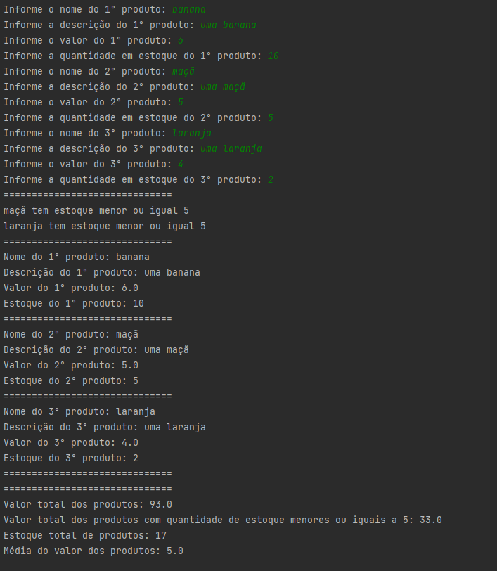
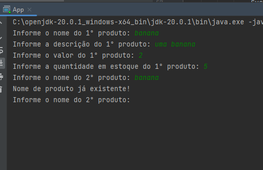
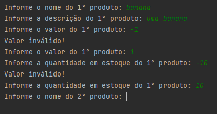

Este é uma projeto para praticar Programação Oriantada a Objetos em Java.

O objetivo do projeto é o programa pedir para o usuário que informe o nome, descrição, valor e quantidade em estoque de vários produtos.

O programa informa ao usuário quais produtos possuem estoque igual ou inferior a cinco, bem como o valor total dos produtos e dos produtos com estoque igual o inferior a cinco. O programa também informa ao usuário o estoque total dos produtos e a média de uma unidade de cada produto.

O programa não aceita produtos com nomes iguais ou com valores de estoque e preço negativos.

Comportamento ao informar nomes iguais aos produtos:

Comportamento ao informar preço e quntidade em estoque negativos aos produtos:

